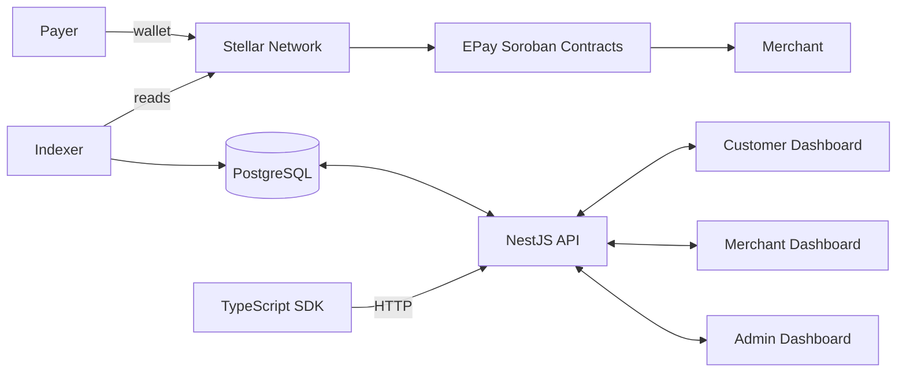

# EPay Architecture

This document describes the system architecture of EPay, a decentralized payment gateway
built on the Stellar network using Soroban smart contracts. It is intended for maintainers,
contributors, and reviewers evaluating the project's technical substance.

## System Overview

EPay provides payment infrastructure without a centralized payment processor. Funds move
directly between payers and merchants on the Stellar network, while EPay's off-chain
components provide the orchestration, indexing, and user interfaces that make on-chain
payments usable.



## Repository Layout

```text
apps/
  api/                  NestJS REST API (15 modules)
  web/                  Customer landing page + dashboard (Next.js)
  merchant-dashboard/   Merchant analytics & management (Next.js)
  admin-dashboard/      Platform administration (Next.js)
  indexer/              Stellar Horizon + Soroban event indexer (BullMQ)

packages/
  contracts/            12 Soroban (Rust) smart contracts
  sdk/                  TypeScript SDK (Stellar SDK + Soroban SDK)
  database/             Prisma ORM schema (21 models)
  types/                Shared TypeScript types
  ui/                   Shared React UI components
  hooks/                React hooks (useApi, useAuth, useWallet, ...)
  shared/               Shared utilities & Stellar helpers
  config/               Environment-based configuration
```

## On-chain Layer — Soroban Smart Contracts

All financial state lives on-chain. The contracts are written in Rust and compiled to WASM
for the Soroban runtime.

| Contract               | Responsibility                                    |
| ---------------------- | ------------------------------------------------- |
| `PaymentRouter`        | Routes and records payments between parties       |
| `InvoiceManager`       | Invoice lifecycle (create, settle, cancel)        |
| `EscrowManager`        | Multi-milestone escrow with dispute resolution    |
| `RefundManager`        | Full and partial refund engine                    |
| `SubscriptionManager`  | Recurring billing with intervals and auto-renewal |
| `SettlementManager`    | Periodic settlement processing                    |
| `MerchantRegistry`     | Merchant onboarding and verification              |
| `TreasuryVault`        | Treasury accounting and fee collection            |
| `FeeManager`           | Configurable fee structure                        |
| `ConfigurationManager` | Platform-wide configuration                       |
| `EmergencyPause`       | Circuit breaker for emergency halts               |
| `RoleManager`          | Role-based access control                         |

### Contract security model

- Every state-mutating function performs an authorization check.
- Roles (Admin, Merchant, Customer, Developer) are enforced through `RoleManager`.
- `EmergencyPause` is a global circuit breaker that can halt value movement.
- The escrow, treasury, and fee contracts are treated as the highest-risk components
  and are gated behind an external audit before mainnet (see `ROADMAP.md`).

## Off-chain Layer

### Indexer (`apps/indexer`)

The indexer keeps the PostgreSQL database in sync with on-chain state.

- Scans Stellar Horizon ledger-by-ledger with configurable batch sizes.
- Decodes Soroban events for five contract families (Payment, Escrow, Refund,
  Subscription, Treasury).
- Two sync modes: historical backfill and real-time (with exponential backoff).
- Work is distributed through a BullMQ queue with 5x concurrency and rate limiting.
- Checkpoint-based crash recovery persists progress in Prisma.

### API (`apps/api`)

A NestJS + Fastify server exposing a REST API. Key modules: `Database`, `Health`, `Auth`,
`Merchant`, `Payment`, `Invoice`, `Escrow`, `Refund`, `Subscription`, `Settlement`,
`Treasury`, `Notification`, `Webhook`, `Analytics`, `Audit`.

- Authentication: JWT (email/password) and Stellar wallet signatures; API keys for
  programmatic access; role-based guards.
- Validation: Zod schemas and DTOs on all inputs.
- Rate limiting on auth and payment endpoints.
- Swagger documentation at `/api/docs` in development.

### Dashboards

Three Next.js apps share the `@epay/ui`, `@epay/hooks`, `@epay/types`, and `@epay/shared`
packages:

| App                  | Audience        | Purpose                                                                           |
| -------------------- | --------------- | --------------------------------------------------------------------------------- |
| `web`                | Customers       | Landing page, auth, payment dashboard                                             |
| `merchant-dashboard` | Merchants       | Payments, invoices, analytics, settlements, refunds, subscriptions, payment links |
| `admin-dashboard`    | Platform admins | Merchant approvals, audit log, platform health, emergency pause                   |

### SDK (`packages/sdk`)

A TypeScript SDK used by integrators. `EPayClient` handles JWT/API-key auth, retries with
backoff, and timeouts; `WalletClient` handles Stellar message signing and balance lookup.
Resource modules cover payments, payment links, invoices, escrows, refunds, subscriptions,
merchants, settlements, and analytics.

## Data Flow — Payment

1. A merchant creates a payment request via the API or a payment link.
2. The payer signs a Stellar transaction that invokes the relevant Soroban contract.
3. The transaction settles on the Stellar network; funds move directly to the merchant's
   address (EPay never takes custody).
4. The indexer observes the ledger/Soroban events and writes a `Payment` record to
   PostgreSQL.
5. The API reads the record, updates the merchant dashboard, and fires webhooks and
   notifications.

## Key Design Decisions

- **Non-custodial by construction.** EPay does not hold funds; private keys stay with
  users. This removes a whole class of custody risk but shifts wallet-security
  responsibility to users.
- **On-chain source of truth.** Contract state is authoritative; the database is a
  read-model rebuilt by the indexer, so it can be re-derived from the chain at any time.
- **Emergency pause.** A dedicated circuit-breaker contract and an admin-only pause action
  allow halting value movement without upgrading contracts.
- **Audit logging.** All state-mutating platform actions are written to an immutable
  `AuditLog`.

## Testing

| Package     | Framework  | Coverage                                         |
| ----------- | ---------- | ------------------------------------------------ |
| `contracts` | Cargo test | 12 spec files                                    |
| `api`       | Jest       | 16 suites, 105 tests (~50% lines; services ~76%) |
| `sdk`       | Vitest     | 4 suites, 91 tests (87% statements/lines)        |

Run `pnpm test` for the full suite, or scope with `pnpm --filter <package> test`.
