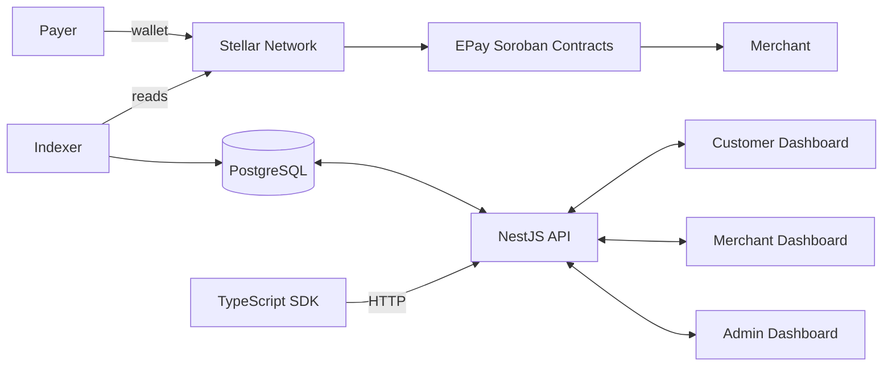

# EPay Architecture

This document describes the system architecture of EPay, a decentralized payment gateway
built on the Stellar network using Soroban smart contracts. It is intended for maintainers,
contributors, and reviewers evaluating the project's technical substance.

## System Overview

EPay provides payment infrastructure without a centralized payment processor. Funds move
directly between payers and merchants on the Stellar network, while EPay's off-chain
components provide the orchestration, indexing, and user interfaces that make on-chain
payments usable.



## Repository Layout

```text
apps/
  api/                  NestJS REST API (15 modules)
  web/                  Customer landing page + dashboard (Next.js)
  merchant-dashboard/   Merchant analytics & management (Next.js)
  admin-dashboard/      Platform administration (Next.js)
  indexer/              Stellar Horizon + Soroban event indexer (BullMQ)

packages/
  contracts/            12 Soroban (Rust) smart contracts
  sdk/                  TypeScript SDK (Stellar SDK + Soroban SDK)
  database/             Prisma ORM schema (21 models)
  types/                Shared TypeScript types
  ui/                   Shared React UI components
  hooks/                React hooks (useApi, useAuth, useWallet, ...)
  shared/               Shared utilities & Stellar helpers
  config/               Environment-based configuration
```

## On-chain Layer — Soroban Smart Contracts

All financial state lives on-chain. The contracts are written in Rust and compiled to WASM
for the Soroban runtime.

| Contract               | Responsibility                                    |
| ---------------------- | ------------------------------------------------- |
| `PaymentRouter`        | Routes and records payments between parties       |
| `InvoiceManager`       | Invoice lifecycle (create, settle, cancel)        |
| `EscrowManager`        | Multi-milestone escrow with dispute resolution    |
| `RefundManager`        | Full and partial refund engine                    |
| `SubscriptionManager`  | Recurring billing with intervals and auto-renewal |
| `SettlementManager`    | Periodic settlement processing                    |
| `MerchantRegistry`     | Merchant onboarding and verification              |
| `TreasuryVault`        | Treasury accounting and fee collection            |
| `FeeManager`           | Configurable fee structure                        |
| `ConfigurationManager` | Platform-wide configuration                       |
| `EmergencyPause`       | Circuit breaker for emergency halts               |
| `RoleManager`          | Role-based access control                         |

### Contract security model

- Every state-mutating function performs an authorization check.
- Roles (Admin, Merchant, Customer, Developer) are enforced through `RoleManager`.
- `EmergencyPause` is a global circuit breaker that can halt value movement.
- The escrow, treasury, and fee contracts are treated as the highest-risk components
  and are gated behind an external audit before mainnet (see `ROADMAP.md`).

## Off-chain Layer

### Indexer (`apps/indexer`)

The indexer keeps the PostgreSQL database in sync with on-chain state.

- Scans Stellar Horizon ledger-by-ledger with configurable batch sizes.
- Decodes Soroban events for five contract families (Payment, Escrow, Refund,
  Subscription, Treasury).
- Two sync modes: historical backfill and real-time (with exponential backoff).
- Work is distributed through a BullMQ queue with 5x concurrency and rate limiting.
- Checkpoint-based crash recovery persists progress in Prisma.

### API (`apps/api`)

A NestJS + Fastify server exposing a REST API. Key modules: `Database`, `Health`, `Auth`,
`Merchant`, `Payment`, `Invoice`, `Escrow`, `Refund`, `Subscription`, `Settlement`,
`Treasury`, `Notification`, `Webhook`, `Analytics`, `Audit`.

- Authentication: JWT (email/password) and Stellar wallet signatures; API keys for
  programmatic access; role-based guards.
- Validation: Zod schemas and DTOs on all inputs.
- Rate limiting on auth and payment endpoints.
- Swagger documentation at `/api/docs` in development.

### Dashboards

Three Next.js apps share the `@epay/ui`, `@epay/hooks`, `@epay/types`, and `@epay/shared`
packages:

| App                  | Audience        | Purpose                                                                           |
| -------------------- | --------------- | --------------------------------------------------------------------------------- |
| `web`                | Customers       | Landing page, auth, payment dashboard                                             |
| `merchant-dashboard` | Merchants       | Payments, invoices, analytics, settlements, refunds, subscriptions, payment links |
| `admin-dashboard`    | Platform admins | Merchant approvals, audit log, platform health, emergency pause                   |

### SDK (`packages/sdk`)

A TypeScript SDK used by integrators. `EPayClient` handles JWT/API-key auth, retries with
backoff, and timeouts; `WalletClient` handles Stellar message signing and balance lookup.
Resource modules cover payments, payment links, invoices, escrows, refunds, subscriptions,
merchants, settlements, and analytics.

## Data Flow — Payment

1. A merchant creates a payment request via the API or a payment link.
2. The payer signs a Stellar transaction that invokes the relevant Soroban contract.
3. The transaction settles on the Stellar network; funds move directly to the merchant's
   address (EPay never takes custody).
4. The indexer observes the ledger/Soroban events and writes a `Payment` record to
   PostgreSQL.
5. The API reads the record, updates the merchant dashboard, and fires webhooks and
   notifications.

## Key Design Decisions

- **Non-custodial by construction.** EPay does not hold funds; private keys stay with
  users. This removes a whole class of custody risk but shifts wallet-security
  responsibility to users.
- **On-chain source of truth.** Contract state is authoritative; the database is a
  read-model rebuilt by the indexer, so it can be re-derived from the chain at any time.
- **Emergency pause.** A dedicated circuit-breaker contract and an admin-only pause action
  allow halting value movement without upgrading contracts.
- **Audit logging.** All state-mutating platform actions are written to an immutable
  `AuditLog`.

## Testing

| Package     | Framework  | Coverage                                                         |
| ----------- | ---------- | ---------------------------------------------------------------- |
| `contracts` | Cargo test | 16 suites + property/fuzz tests on the 4 funds-at-risk contracts |
| `api`       | Jest       | 16 suites, 105 tests (~50% lines; services ~76%)                 |
| `sdk`       | Vitest     | 4 suites, 91 tests (87% statements/lines)                        |
| `shared`    | Vitest     | webhook signing, verification, and retry policy                  |
| `tests/e2e` | Playwright | customer web + dashboards, with axe-core a11y checks             |
| `tests/k6`  | k6         | load profile; SLOs in [`performance.md`](./performance.md)       |

Run `pnpm test` for the full suite, or scope with `pnpm --filter <package> test`.

---

## Rationale — why these choices

The tree above describes _what_ exists. This section records _why_, so a future
maintainer can tell an intentional constraint from an accident. Longer-form
decisions with alternatives and consequences live in [`docs/adr/`](./adr/).

### Why NestJS over bare Express

A payment gateway's hard parts are cross-cutting: authentication, authorisation,
validation, rate limiting, audit logging, and observability. In bare Express each
of those is hand-wired per route, and every new endpoint is a chance to forget
one. NestJS makes them **structural**: guards, pipes, interceptors, and filters
are declared once and applied uniformly.

Concretely, in this codebase a route cannot accidentally ship without:

- input validation (`ValidationPipe` with `whitelist` and `forbidNonWhitelisted`),
- a rate-limit decision (global `ThrottlerGuard`),
- metrics and error reporting (`APP_INTERCEPTOR` in `ObservabilityModule`),
- RBAC, because guards compose.

The cost is a framework-shaped dependency graph and a learning curve for
contributors. We accept it: the alternative is a codebase where security is
reviewed per-diff rather than by construction, which is exactly how payment APIs
leak. See [ADR 0003](./adr/0003-auth-model.md) for the auth decision.

> **Also relevant:** the API uses **Fastify** as the HTTP adapter under Nest, not
> Express. Nest's abstractions are adapter-agnostic, so we get Fastify's lower
> per-request overhead and its `routerPath` (used to keep metric label cardinality
> bounded) without giving up the guard/pipe/interceptor model.

### Why twelve discrete contracts instead of one monolith

See [ADR 0005](./adr/0005-contract-decomposition.md) for the full argument. In
short: a single contract would hold every fund, so a bug in _any_ code path
threatens _all_ funds, and an upgrade to fix a fee calculation would require
re-auditing escrow and treasury. Splitting by responsibility gives each contract
one storage layout, one owner, and one blast radius — and it lets the audit, the
pause switch, and the fee cap be scoped to the contracts that actually touch
value. The contracts already share nothing at the storage level, so the split
costs one cross-contract call on the paths that need it and nothing elsewhere.

### Why Prisma

- **The schema is the contract.** One declarative file defines 22 models, their
  relations, enums, and indexes; TypeScript types are generated from it, so a
  field rename is a compile error rather than a runtime `undefined`.
- **Migrations are code.** `prisma migrate` produces reviewable SQL that ships
  with the change and runs in CI, including the monthly restore drill.
- **The database is a read-model.** Because on-chain state is authoritative,
  being able to drop and rebuild the database from chain history is a feature;
  Prisma's migration history is what makes that rebuild reproducible.

The trade-off is a heavier runtime than a thin `pg` client and a code-generation
step in the build. For a schema this relational, the type safety is worth it.

### How the indexer reconciles with on-chain state

Contract state is the **source of truth**; PostgreSQL is a derived read-model.
The indexer is the only thing allowed to write chain-derived rows, and it
reconciles by construction rather than by comparison:

1. **Ordered, checkpointed ingestion.** Ledgers are scanned in order, in batches,
   and a checkpoint (last processed ledger) is persisted in Prisma after each
   batch. A crash resumes from the checkpoint, so no ledger is skipped and none is
   processed twice without being idempotent.
2. **Events carry ids, handlers are idempotent.** Every handler keys on the
   contract-assigned id (`payment_id`, `escrow_id`, …) and upserts. Replaying a
   ledger is safe.
3. **Lag is observable and alerting.** The gap between the chain head and the
   checkpoint is exported as a metric, and `EpayQueueLagHigh` fires when the
   indexer falls behind — so "the database is wrong" surfaces as an alert, not as
   a support ticket.
4. **Re-derivation is always possible.** Because the indexer is the only writer of
   chain-derived data, any suspected corruption can be resolved by replaying from
   a known ledger rather than by hand-repairing rows.

This is why the API never mutates payment status directly: an endpoint changing a
row the indexer owns would be silently reverted on the next replay, and the two
writers would disagree. The API writes _requests_; the chain writes _facts_; the
indexer translates.

### Why three dashboards instead of one role-gated app

See [ADR 0006](./adr/0006-dashboard-decomposition.md). Short version: customers,
merchants, and platform admins share almost no screens, and shipping them as one
app means every bundle includes admin code and every role check is a runtime
condition rather than a routing boundary. Three apps let the admin attack surface
be deployed, rate-limited, and (soon) network-isolated independently.

The cost is three deployments and a shared component library to keep them
consistent — which is why `@epay/ui`, `@epay/hooks`, and `@epay/types` exist.
